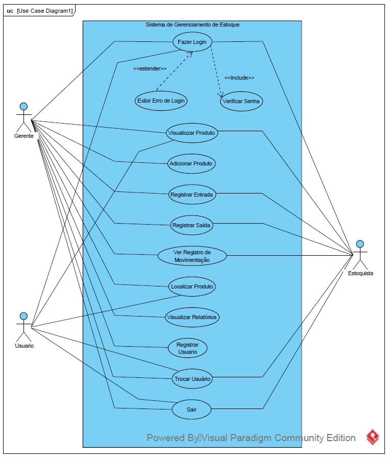

# PROJETO_INTEGRADO_INOVACAO-ADS
 Desenvolvimento do Sistema de Gerenciamento de Estoque

## DOCUMENTAÇÃO
### 1. **Introdução**
   - **Descrição**: Apresentar brevemente o propósito do sistema, destacando que é um software de gerenciamento de estoque voltado para uma empresa de comércio eletrônico. Ele permite o cadastro de produtos, controle de estoque, rastreamento de movimentações e geração de relatórios.
   - **Funcionalidades principais**:
     - Login de usuários com diferentes funções (gerente, estoquista, usuário).
     - Registro de produtos, entradas e saídas.
     - Visualização de produtos e movimentações.
     - Geração de relatórios de estoque.

### 2. **Configuração e Requisitos**
   - **Pré-requisitos**:
     - Python 3.8 ou superior.
     - Bibliotecas necessárias: `sqlite3`, `datetime`, `matplotlib`, `seaborn`, `getpass`.
     - Banco de dados SQLite configurado (`estoque.db`) com tabelas necessárias (`Usuarios`, `Produtos`, `Movimentacoes`).
   - **Instalação**:
     - Passo a passo para instalação das bibliotecas:
       "pip install matplotlib seaborn"

     - Configuração do banco de dados (criação e estrutura das tabelas).

### 3. **Arquitetura do Sistema**
   - **Visão Geral**: Explicação das camadas do sistema:
     - **Banco de Dados**: Gerencia os dados dos usuários, produtos e movimentações.
     - **Funções**: Funções individuais que realizam operações específicas no banco de dados.
     - **Interface de Linha de Comando**: Menu de opções que direciona o usuário às funções com base na permissão de acesso.

### 4. **Funcionalidades e Fluxo de Trabalho**
   - **Login e Registro de Usuários**:
     - Descrição do processo de login com validação de credenciais.
     - Explicação sobre o registro de novos usuários com diferentes funções.
   - **Visualização e Gerenciamento de Produtos**:
     - Exibição dos produtos com ID, nome, categoria, quantidade, preço e localização.
     - Explicação sobre o registro de entrada e saída de produtos no estoque.
   - **Visualização de Movimentações**:
     - Como acessar e exibir o histórico de movimentações de entrada e saída.
   - **Relatórios**:
     - Geração de gráficos usando Matplotlib e Seaborn para mostrar a quantidade de produtos e as movimentações no estoque.
   
### 5. **Tabelas e Estrutura de Dados**
   - **Tabela `Usuarios`**:
     - Campos: `username`, `senha`, `role`.
   - **Tabela `Produtos`**:
     - Campos: `id`, `nome`, `categoria`, `quantidade`, `preco`, `localizacao`.
   - **Tabela `Movimentacoes`**:
     - Campos: `id`, `produto_id`, `quantidade`, `tipo`, `data`.

### 6. **Guias de Uso**
   - **Acesso**:
     - Como efetuar o login e o que fazer em caso de erro de login.
   - **Cadastro de Produtos e Movimentações**:
     - Passo a passo para adicionar produtos, registrar entradas e saídas, e visualizar movimentações.
   - **Geração de Relatórios**:
     - Instruções para gerar e visualizar gráficos de produtos e movimentações.

### 7. **Erros Comuns e Soluções**
   - Tabelar possíveis mensagens de erro (ex.: "Erro ao acessar o banco de dados") e as respectivas soluções.

### 8. **Segurança**
   - Breve explicação sobre o uso de `getpass` para ocultar a senha.
   - Recomendações de segurança, como uso de hashing de senhas e boas práticas de configuração do banco de dados.

### 9. **Conclusão e Próximos Passos**
   - **Resumo**: Reforçar os objetivos do sistema e as funcionalidades já implementadas.
   - **Evolução**: Possíveis melhorias, como a inclusão de uma interface gráfica ou a implementação de autenticação segura com hashing de senhas.

## RELATÓRIO DE DESENVOLVIMENTO

### Sprint 1 - Relatório

**Objetivo da Sprint**: Criar a estrutura básica do banco de dados e as funcionalidades de cadastro e atualização de produtos.

**Tarefas Concluídas**:
- Configuração inicial do banco de dados SQLite e criação das tabelas principais, como `Produtos`.
- Implementação da função de cadastro de produtos.
- Desenvolvimento da funcionalidade de atualização de estoque.

**Desafios Encontrados**:
- Ajustes na inserção de dados no banco de dados, como lidar com entradas inválidas.
- A necessidade de adaptar o banco para aceitar novas informações ao longo do desenvolvimento.

**Lições Aprendidas**:
- Testar as inserções e atualizações com dados variados ajuda a identificar inconsistências na estrutura.

**Próximos Passos**:
- Implementar funcionalidades de rastreamento de localização.
- Trabalhar no sistema de geração de relatórios.

---

### Sprint 2 - Relatório

**Objetivo da Sprint**: Desenvolver as funcionalidades de rastreamento de localização e iniciar os relatórios.

**Tarefas Concluídas**:
- Implementação do sistema de rastreamento de localização no depósito.
- Criação de relatórios básicos que indicam a quantidade e localização dos produtos.

**Desafios Encontrados**:
- Desafios na criação de uma forma clara e acessível de visualização de relatórios.
- Identificação de melhorias necessárias no banco de dados para incluir categorias.

**Lições Aprendidas**:
- O design do banco de dados é crucial para a eficácia e eficiência da consulta de dados.

**Próximos Passos**:
- Expandir os relatórios para incluir produtos em falta e excesso de estoque.
- Realizar testes e ajustes nas funcionalidades de relatórios.

---

### Sprint 3 - Relatório

**Objetivo da Sprint**: Finalizar os relatórios e realizar testes nas funcionalidades.

**Tarefas Concluídas**:
- Finalização dos relatórios detalhados, incluindo alertas de estoque baixo e excessivo.
- Implementação de uma estrutura de permissões para diferentes tipos de usuários.

**Desafios Encontrados**:
- Implementar permissões adequadas para diferentes tipos de usuários sem uma interface gráfica.
- Ajustar a saída dos relatórios para facilitar a leitura.

**Lições Aprendidas**:
- A estrutura de permissões melhora o gerenciamento, mas requer testes para assegurar o funcionamento adequado.

**Próximos Passos**:
- Testes finais e ajustes no sistema com base no feedback dos usuários.
- Preparação para a entrega final e documentação completa do sistema.

## CONSTRUÇÃO DA TABELA DA VERDADE

### Variáveis Booleanas

As variáveis booleanas a serem usadas são:

- **P**: Cadastro de Produtos — Verdadeiro (True) se o sistema permite o cadastro de novos produtos.
- **E**: Atualização de Estoque — Verdadeiro (True) se o sistema permite a atualização da quantidade de produtos em estoque.
- **L**: Rastreamento de Localização — Verdadeiro (True) se o sistema possibilita o rastreamento da localização dos produtos.
- **R**: Relatórios — Verdadeiro (True) se o sistema gera relatórios sobre o estado do estoque.

### Tabela Verdade

A tabela verdade mostrará todas as combinações possíveis dos valores das variáveis booleanas e indicará se a combinação atende a todos os requisitos (ou seja, se a **Solução Completa** é atendida). A **Solução Completa** será Verdadeira (True) somente quando todas as variáveis forem True, significando que o sistema atende a todos os requisitos.

| P (Cadastro de Produtos) | E (Atualização de Estoque) | L (Rastreamento de Localização) | R (Relatórios) | Solução Completa (P ∧ E ∧ L ∧ R) |
|---------------------------|----------------------------|----------------------------------|----------------|-----------------------------------|
| True                      | True                       | True                             | True           | True                              |
| True                      | True                       | True                             | False          | False                             |
| True                      | True                       | False                            | True           | False                             |
| True                      | True                       | False                            | False          | False                             |
| True                      | False                      | True                             | True           | False                             |
| True                      | False                      | True                             | False          | False                             |
| True                      | False                      | False                            | True           | False                             |
| True                      | False                      | False                            | False          | False                             |
| False                     | True                       | True                             | True           | False                             |
| False                     | True                       | True                             | False          | False                             |
| False                     | True                       | False                            | True           | False                             |
| False                     | True                       | False                            | False          | False                             |
| False                     | False                      | True                             | True           | False                             |
| False                     | False                      | True                             | False          | False                             |
| False                     | False                      | False                            | True           | False                             |
| False                     | False                      | False                            | False          | False                             |

### Interpretação

- A coluna **Solução Completa** representa o resultado de `P ∧ E ∧ L ∧ R` (onde ∧ é a operação lógica AND).
- Somente a linha em que todas as variáveis são **True** resulta em uma **Solução Completa** True. Isso representa o cenário em que o sistema atende a todos os requisitos simultaneamente.

## DIAGRAMA DE CASO DE USO

